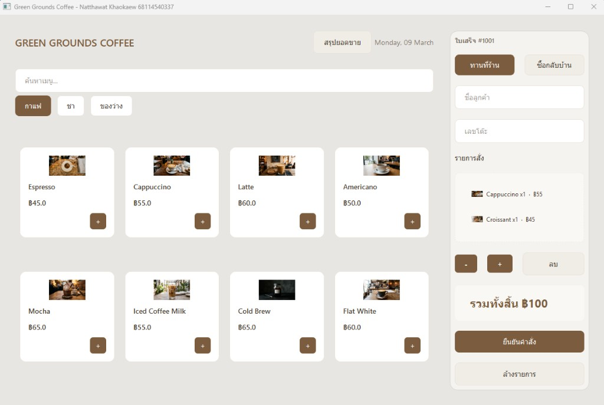

# Green Grounds Coffee

โปรแกรมขายหน้าร้านกาแฟ พัฒนาด้วย Python และ PyQt6 สำหรับใช้ในการรับคำสั่งซื้อ แสดงใบเสร็จ และสรุปยอดขาย



## ผู้จัดทำ

นัธทวัฒน์ เขาแก้ว 68114540337

## ความต้องการของระบบ

- Python 3.9 ขึ้นไป
- PyQt6

## วิธีการติดตั้ง

1. Clone โปรเจกต์

```bash
git clone https://github.com/Natthawat-68/coffee_oop.git
cd coffee_oop
```

2. สร้าง Virtual Environment (ถ้าต้องการ)

```bash
python -m venv venv
venv\Scripts\activate
```

3. ติดตั้ง Library

```bash
pip install -r requirements.txt
```

4. รันโปรแกรม

```bash
python main.py
```

## โครงสร้างโปรเจกต์

```
coffee_oop/
├── main.py              ไฟล์หลัก
├── styles.py            กำหนดสไตล์ UI
├── requirements.txt     รายการ Library
├── pyproject.toml       การตั้งค่าโปรเจกต์
├── models/
│   ├── __init__.py
│   ├── menu.py          โมเดลเมนู (Beverage, Snack, MenuItem)
│   └── order.py         โมเดลคำสั่งซื้อ (Order, OrderItem)
└── assets/images/       รูปภาพเมนู
```

## ฟีเจอร์หลัก

- เลือกเมนูตามหมวดหมู่ (กาแฟ, ชา, ของว่าง) และค้นหาเมนู
- เพิ่ม/ลดจำนวน/ลบรายการในคำสั่งซื้อ
- เลือกประเภทการรับ: ทานที่ร้าน (ระบุเลขโต๊ะ) หรือซื้อกลับบ้าน
- ยืนยันคำสั่งและสร้างใบเสร็จ สามารถบันทึกภาพใบเสร็จได้
- สรุปยอดขายตามช่วงวันที่
- บันทึกประวัติคำสั่งซื้อลงไฟล์ order_history.json

## วิธีใช้งาน

1. เลือกหมวดหมู่เมนูหรือค้นหาชื่อเมนู
2. กดปุ่ม + ที่การ์ดเมนูเพื่อเพิ่มรายการ
3. กรอกชื่อลูกค้า เลขโต๊ะ (กรณีทานที่ร้าน)
4. เลือก "ทานที่ร้าน" หรือ "ซื้อกลับบ้าน"
5. ปรับจำนวนหรือลบรายการด้วยปุ่ม - และ ลบ
6. กด "ยืนยันคำสั่ง" เพื่อสร้างใบเสร็จ
7. กด "สรุปยอดขาย" เพื่อดูรายงานและสถิติ
